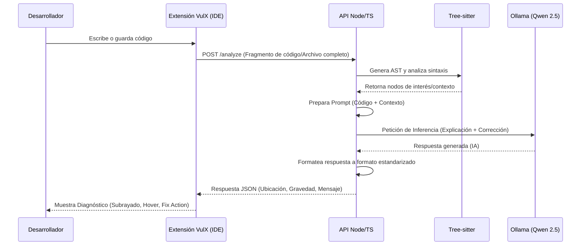

# Arquitectura de VulX

Este documento describe la arquitectura general, los componentes principales, el flujo de datos y el modelo de interoperabilidad de **VulX**, un sistema inteligente de detección y explicación de vulnerabilidades en código.

## 1. Diagrama de Componentes

La arquitectura de VulX sigue un modelo cliente-servidor ligero que se ejecuta de manera 100% local, dividida en tres capas principales:

```mermaid
graph TD
    subgraph CapaCliente ["Capa Cliente (IDE)"]
        V[Extensión VulX .vsix]
    end

    subgraph CapaServidor ["Capa Servidor (API Local - Node/TypeScript)"]
        API[API REST VulX]
        TS[Motor de Análisis: Tree-sitter]
        PM[Orquestador / Gestor de Prompts]
    end

    subgraph CapaIA ["Capa de Inteligencia Artificial Local"]
        O[Ollama]
        M[Modelo: Qwen 2.5 Coder 7B]
    end

    %% Relaciones
    V <-->|HTTP / REST (JSON)| API
    API --> TS
    API --> PM
    PM <-->|API REST Local| O
    O --> M
```

### Descripción de Componentes
* **Extensión VulX (.vsix)**: Actúa como la interfaz de usuario directamente integrada en el editor (VS Code o Antigravity). Es un cliente ligero encargado de recolectar el código escrito, enviarlo a la API y mostrar los diagnósticos y recomendaciones al desarrollador.
* **API REST (Node.js / TypeScript)**: El núcleo del sistema. Orquesta la comunicación entre el IDE y el motor de IA.
* **Tree-sitter**: Se utiliza dentro del backend para el análisis estructural (generación de Abstract Syntax Trees - AST). Permite extraer el contexto del código o identificar patrones preliminares antes de consultar a la IA.
* **Ollama + Qwen 2.5 Coder 7B**: Infraestructura local para ejecutar la inferencia de inteligencia artificial, asegurando privacidad (sin envío a la nube) y baja latencia.

---

## 2. Flujo de Datos

El flujo de información desde la edición de código hasta la sugerencia de corrección sigue este proceso secuencial:



1. **Captura:** El desarrollador escribe o modifica un archivo. La extensión captura el texto del editor.
2. **Pre-procesamiento:** La petición llega a la API, que utiliza Tree-sitter para entender la estructura del código y acotar el análisis.
3. **Inferencia Local:** La API compone un prompt específico y se lo pasa a Ollama. El modelo de IA local analiza el código en busca de vulnerabilidades lógicas o de seguridad.
4. **Feedback:** La API procesa la respuesta de la IA (generalmente devolviéndola en formato estructurado) y se la pasa a la extensión, la cual subraya la vulnerabilidad en el editor y ofrece un panel de explicación y solución (Quick Fix).

---

## 3. Modelo de Interoperabilidad con Antigravity

VulX está diseñado para ser agnóstico del entorno, siempre que este soporte los estándares actuales. La interoperabilidad con **Antigravity** (así como con VS Code) se logra mediante:

* **Estándar VSIX:** La extensión se empaqueta como un archivo `.vsix`. Antigravity posee compatibilidad arquitectónica para cargar extensiones con este estándar o basadas en los protocolos de editor de código actuales (Language Server Protocol / Editor APIs estándar).
* **Desacoplamiento (Cliente Ligero):** Todo el trabajo pesado de análisis (Tree-sitter) y de Inteligencia Artificial (Ollama) ocurre fuera del proceso del editor, a través de la API REST local. Esto significa que la extensión en Antigravity solo necesita saber hacer llamadas HTTP y mostrar notificaciones o diagnósticos, minimizando posibles problemas de compatibilidad de API internas del editor.
* **Ejecución Local Compartida:** Dado que Ollama y la API de VulX se ejecutan como procesos de sistema operativo independientes en la máquina local (localhost), cualquier instancia de Antigravity o VS Code puede apuntar al mismo puerto de la API sin requerir integraciones nativas complejas.
